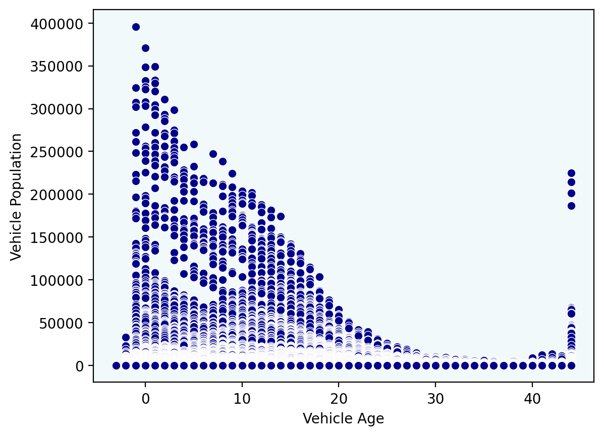

# 🌙 Rice Datathon 2025 - OwlNighter 🦉  

Welcome to the **OwlNighter** team repository for **Rice Datathon 2025**!  

Over the past **36 hours**, we've tackled the **Chevron Challenge** and achieved an impressive **root mean square error** (RMSE) result. 🚀  

## 👥 Team Members  
- **Nam Nguyen**  
- **Phan Nguyen**  
- **Huaijin Sun**  
- **Shunyuao Mao**  

## 📥 Installation  

1. Clone the repository:  
   ```bash
   git clone https://github.com/hiitsmocha/rice-datathon-2025.git
   cd rice-datathon-2025
   ```

2. Install dependencies:  
   ```bash
   pip install -r requirements.txt
   ```

## 🚀 Usage  

You can run this project locally on your own machine!  

Start the app with:  
```bash
streamlit run app.py
```

## 🎬 Demo  

Click here [https://youtu.be/3_inqfvuuO0] to watch our demo video!  

BELOW ARE OUR FINDINGS IN THIS PROJECT. SOME OF THE IMAGES/TABLES MIGHT NOT WORK ON YOUR MACHINE. PLEASE RUN STREAMLIT LOCALLY TO HAVE THE BEST EXPERIENCE
## 🏗 Data Wrangling

### Step 1: Load and Display the Dataset

First, we load the dataset and display the first few rows to understand its structure.

```
# Load the dataset
data = pd.read_csv("our_dataset.csv")
```
```
# Display the first 5 rows
data.head()
```
**Explanation** : The dataset is loaded using pd.read_csv(), and the first 5 rows are displayed using data.head().

#### 🔍 Raw Dataset Preview

### Step 2: Basic Information about the Dataset

Next, we check the dataset's shape, info, and missing values.

```
# Check dataset shape
print(f"Number of rows: {data.shape[ 0 ]}, Number of columns: {data.shape[ 1 ]}")
```
```
# Display dataset info
data.info()
```
```
# Check for missing values
data.isnull().sum()
```
**Explanation** : We use data.shape to get the dimensions, data.info() to see column types, and data.isnull().sum() to check for missing values.

      
### Step 3: Handle Missing Values

We handle missing values by filling numerical columns with the median and categorical columns with the mode.

```
# Fill missing values in numerical columns with median
data['Model Year'].fillna(data['Model Year'].median(), inplace=True)
```
```
# Fill missing values in categorical columns with mode
for col in data.columns:
if data[col].dtype == "object" or pd.api.types.is_categorical_dtype(data[col]):
data[col].fillna(data[col].mode()[ 0 ], inplace=True)
```
**Explanation** : Missing values in numerical columns are filled with the median, while categorical columns are filled with the mode.

### Step 4: Convert Data Types

We convert the 'Date' column to datetime format and categorical columns to the 'category' dtype.

```
# Convert 'Date' to datetime and extract the year
data['Date'] = pd.to_datetime(data['Date'], format='%Y').dt.year
```

```
# Convert categorical columns to 'category' dtype
categorical_columns = ['Vehicle Category', 'GVWR Class', 'Fuel Type', 'Fuel Technology', 'Electric Mile Range', 'Number of Vehi
for col in categorical_columns:
data[col] = data[col].astype('category')
```
**Explanation** : The 'Date' column is converted to datetime, and categorical columns are converted to the 'category' dtype for efficient memory usage.

### Step 5: Remove Duplicates and Reset Index

We remove duplicate rows and reset the index for consistency.

```
# Remove duplicates
data.drop_duplicates(inplace=True)
```
```
# Reset index
data.reset_index(drop=True, inplace=True)
```
**Explanation** : Duplicates are removed using drop_duplicates(), and the index is reset using reset_index().


## 📊 Exploratory Data Analysis

### Step 6: Feature Engineering

We create a new feature called 'Vehicle Age' by subtracting the 'Model Year' from the 'Date'.

```
# Create 'Vehicle Age' feature
data["Vehicle Age"] = data["Date"] - data["Model Year"]
```
**Explanation** : The 'Vehicle Age' feature is created to represent the age of the vehicle in years.

### Step 7: Visualize Data

We visualize the relationship between 'Vehicle Age' and 'Vehicle Population' using a scatter plot.

```
import matplotlib.pyplot as plt
import seaborn as sns
```
```
# Scatter plot: Vehicle Age vs. Vehicle Population
plt.figure(figsize=( 10 , 6 ))
sns.scatterplot(x="Vehicle Age", y="Vehicle Population", data=data)
plt.title("Vehicle Age vs. Vehicle Population")
plt.xlabel("Vehicle Age")
plt.ylabel("Vehicle Population")
plt.grid(True)
plt.show()
```
**Explanation** : A scatter plot is created using seaborn.scatterplot() to visualize the relationship between 'Vehicle Age' and 'Vehicle Population'.

#### 🔍 Vehicle Age vs. Population



#### 📌 Insights

The Vehicle Population is highest for newer vehicles (age 0) and decreases significantly as the age increases. This trend indicates that newer vehicles dominate the
population, while older vehicles (e.g., 30-40 years) are much rarer.

### Step 8: Split Data into Training and Validation Sets

We split the dataset into training and validation sets for modeling.

```
from sklearn.model_selection import train_test_split
```
```
# Split data into features (X) and target (y)
X = data.drop(columns=["Vehicle Population"])
y = data["Vehicle Population"]
```
```
# Split into training and validation sets
X_train, X_val, y_train, y_val = train_test_split(X, y, test_size=0.2, random_state= 42 )
```
**Explanation** : The dataset is split into training and validation sets using train_test_split() with an 80-20 split.

### Step 9: Final Check for Missing Values

We perform a final check to ensure no missing values remain in the dataset.

```
# Check for missing values
data.isnull().sum()
```
**Explanation** : A final check is performed to ensure all missing values have been handled.

### Conclusion

The dataset has been cleaned, preprocessed, and is now ready for modeling. The EDA process included handling missing values, converting data types, removing
duplicates, creating new features, and visualizing relationships between variables.

#### 📌 Processed Dataset Preview


```
📌 Intuition: We aim to predict the vehicle population using machine learning models. We'll train Random Forest, CatBoost, and XGBoost models, tune
hyperparameters, and stack models to improve performance. The reason why we chose these models is that they are robust, handle non-linear relationships
well, and are suitable for regression tasks, especially all the features are categorical data.
```
# ⚙ Random Forest

## Step 1: Train Random Forest Model

First, we train a basic Random Forest model and evaluate its performance on both the validation and test sets.

```
# Train Random Forest model
random_forest_model = RandomForestRegressor(random_state= 28 )
random_forest_model.fit(X_train, y_train)
```
```
# Shuffle validation and test data
X_test, y_test = shuffle(X_test, y_test, random_state= 42 )
```
```
# Evaluate on Validation Set
y_pred_val = random_forest_model.predict(X_val)
print("VALIDATION SET")
print("Mean Absolute Error (MAE):", mean_absolute_error(y_val, y_pred_val))
print("Root Mean Squared Error (RMSE):", math.sqrt(mean_squared_error(y_val, y_pred_val)))
print("R-squared (R2):", r2_score(y_val, y_pred_val))
```
```
# Evaluate on Test Set
y_pred = random_forest_model.predict(X_test)
print("TEST SET")
print("Mean Absolute Error (MAE):", mean_absolute_error(y_test, y_pred))
print("Root Mean Squared Error (RMSE):", math.sqrt(mean_squared_error(y_test, y_pred)))
print("R-squared (R2):", r2_score(y_test, y_pred))
```
## Step 2: Hyperparameter Tuning with GridSearchCV

Now we tune the hyperparameters of the Random Forest model using **GridSearchCV**.

```
param_grid = {
"n_estimators": [ 50 , 100 , 200 ],
"max_depth": [None, 10 , 20 , 30 ],
"min_samples_split": [ 2 , 5 , 10 ],
"min_samples_leaf": [ 1 , 2 , 4 ],
"max_features": ["sqrt", "log2"],
"bootstrap": [True, False]
}
```
```
grid_search = GridSearchCV(estimator=random_forest_model, param_grid=param_grid, cv= 5 ,
scoring="neg_mean_squared_error", n_jobs=- 1 , verbose= 3 )
```
```
grid_search.fit(X_train, y_train)
print(f"Best Parameters: {grid_search.best_params_}")
print(f"Best RMSE from GridSearchCV: {math.sqrt(-grid_search.best_score_)}")
```
## Step 3: Random State Tuning for Optimizing RMSE

Next, we experiment with different random states to find the one that minimizes the RMSE.

```
list_rmse = []
min_rmse = float('inf')
for i in tqdm(range( 1 , 100 )):
rf = RandomForestRegressor(random_state=i)
rf.fit(X_train, y_train)
y_pred = rf.predict(X_test)
rmse_now = math.sqrt(mean_squared_error(y_test, y_pred))
if rmse_now < min_rmse:
min_rmse = rmse_now
print(f"New Min RMSE: {min_rmse} at state {i}")
```

```
list_rmse.append({"state": i, "rmse": rmse_now})
```
```
top_5_rmse = sorted(list_rmse, key=lambda x: x['rmse'])[: 5 ]
for top_rmse in top_5_rmse:
print(f"State: {top_rmse['state']}, RMSE: {top_rmse['rmse']}")
```
# ⚙ CatBoost

## Step 1: Train CatBoost Model

In this step, we train a CatBoost model, perform hyperparameter tuning, and evaluate its performance.

```
from catboost import CatBoostRegressor
from sklearn.metrics import mean_absolute_error, mean_squared_error, r2_score
import math
```
```
# Define best parameters for CatBoost
best_params_catboost = {
'iterations': 1000 ,
'learning_rate': 0.1,
'depth': 8 ,
'l2_leaf_reg': 1 ,
'random_strength': 0.5,
'bagging_temperature': 1 ,
'border_count': 32 ,
'verbose': False,
'random_state': 42
}
```
```
# Initialize CatBoost model with best parameters
catboost_model = CatBoostRegressor(**best_params_catboost)
```
```
# Train the model
catboost_model.fit(X_train_cat, y_train_full, cat_features=categorical_cols)
```
```
# Predictions
catboost_preds = catboost_model.predict(X_test_cat)
```
```
# Evaluate on Test Set
catboost_rmse = np.sqrt(mean_squared_error(y_test_cat, catboost_preds))
print(f"CatBoost RMSE: {catboost_rmse}")
print("*" * 50 )
print("TEST SET")
print("Mean Absolute Error (MAE):", mean_absolute_error(y_test_cat, catboost_preds))
print("Root Mean Squared Error (RMSE):", catboost_rmse)
print("R-squared (R2):", r2_score(y_test_cat, catboost_preds))
```
## Step 2: Hyperparameter Tuning with GridSearchCV or RandomizedSearchCV

You can further fine-tune the hyperparameters using **GridSearchCV** or **RandomizedSearchCV**. Here's how:

```
from sklearn.model_selection import GridSearchCV
```
```
# Define parameter grid for hyperparameter tuning
param_grid = {
'iterations': [ 500 , 1000 , 1500 ],
'learning_rate': [0.01, 0.05, 0.1],
'depth': [ 4 , 6 , 8 ],
'l2_leaf_reg': [ 1 , 3 , 5 ],
'random_strength': [0.1, 0.5, 1 ],
'bagging_temperature': [ 0 , 0.5, 1 ],
'border_count': [ 32 , 64 , 128 ],
'verbose': [False]
}
```
```
# Initialize the CatBoost model
catboost_model = CatBoostRegressor(random_state= 42 , cat_features=categorical_cols)
```
```
# Perform GridSearchCV for hyperparameter tuning
grid_search = GridSearchCV(catboost_model, param_grid, cv= 3 , n_jobs=- 1 , scoring='neg_root_mean_squared_error')
```

```
grid_search.fit(X_train_cat, y_train_full)
```
```
# Get the best parameters found by GridSearchCV
best_params_catboost = grid_search.best_params_
print("Best parameters found by GridSearchCV:", best_params_catboost)
```
```
# Train the model with the best parameters
best_catboost_model = grid_search.best_estimator_
```
```
# Evaluate on Test Set
catboost_preds = best_catboost_model.predict(X_test_cat)
catboost_rmse = np.sqrt(mean_squared_error(y_test_cat, catboost_preds))
print(f"CatBoost RMSE: {catboost_rmse}")
print("*" * 50 )
print("TEST SET")
print("Mean Absolute Error (MAE):", mean_absolute_error(y_test_cat, catboost_preds))
print("Root Mean Squared Error (RMSE):", catboost_rmse)
print("R-squared (R2):", r2_score(y_test_cat, catboost_preds))
```
# ⚙ Stacking Multiple Models

```
📌 Intuition: Leveraging the strengths of multiple models to enhance overall performance. CatBoost is highly sensitive to extreme values, while Random
Forest struggles with very small values. By combining these models, we aim to balance their strengths, improving both accuracy and robustness in our
predictions.
```
## Method 1: Stacking Random Forest and CatBoost with Meta-Model (Linear Regression)

In this method, we combine the predictions of Random Forest and CatBoost models by stacking them and then use a meta-model (Linear Regression) to make

final predictions.

```
from sklearn.linear_model import LinearRegression
from sklearn.metrics import mean_squared_error
import numpy as np
```
```
# Step 1: Fit the trained model with the training data
rf_preds = random_forest_model.predict(X_train)
cb_preds = best_catboost_model.predict(X_train_cat)
```
```
# Step 2: Create a new dataset using model predictions as features
stacked_features_1 = np.column_stack((rf_preds, cb_preds))
```
```
# Step 3: Train the meta-model on training data(using RF predictions as the main guidance)
meta_model = LinearRegression()
meta_model.fit(stacked_features_1, y_train)
```
```
# Step 4: Predict using the meta-model
rf_preds_test = random_forest_model.predict(X_test)
cb_preds_test = best_catboost_model.predict(X_test_cat)
stacked_features_1_test = np.column_stack((rf_preds_test, cb_preds_test))
stacked_preds_1_test = meta_model.predict(stacked_features_1_test)
```
```
# Step 5: Ensure non-negative predictions (since vehicle population can't be negative)
stacked_preds_1 = np.maximum(stacked_preds_1_test, 0 )
```
```
# Step 6: Evaluate performance
rmse_stacked = np.sqrt(mean_squared_error(y_test, stacked_preds_1_test))
mae_stacked = mean_absolute_error(y_test, stacked_preds_1_test)
r2_stacked = r2_score(y_test, stacked_preds_1_test)
```
```
print("TEST SET")
print("Mean Absolute Error (MAE):", mae_stacked)
print("Root Mean Squared Error (RMSE):", rmse_stacked)
print("R-squared (R2):", r2_stacked)
```
## Method 2: Stacking Predictions from Two Random Forest Models and CatBoost with Meta

## Model (Random Forest) - BEST SELECTION


In this method, we stack the predictions from one/two Random Forest models and a CatBoost model and use two Random Forest meta-models to make final

predictions.

```
from sklearn.ensemble import RandomForestRegressor
from sklearn.metrics import mean_squared_error, mean_absolute_error, r2_score
import numpy as np
```
```
# Step 1: Generate features using the trained models
rf_preds_1 = random_forest_model.predict(X_train) # First Random Forest model
rf_preds_2 = random_forest_model_2.predict(X_train) # Second Random Forest model (with different hyperparameters)
cb_preds = best_catboost_model.predict(X_train_cat) # CatBoost predictions
```
```
# Step 2: Stack the predictions from the base models
stacked_features_rf_only = np.column_stack((rf_preds_1, cb_preds))
stacked_features_rf_cb = np.column_stack((rf_preds_1, rf_preds_2, cb_preds))
```
```
# Step 3: Train the meta-model (Random Forest)
meta_rf_only = RandomForestRegressor(random_state= 28 )
meta_rf_only.fit(stacked_features_rf_only, y_train)
meta_rf_cb = RandomForestRegressor(random_state= 28 )
meta_rf_cb.fit(stacked_features_rf_cb, y_train)
```
```
# Step 4: Make final predictions
rf_preds_1_test = random_forest_model.predict(X_test) # First Random Forest model
rf_preds_2_test = random_forest_model_2.predict(X_test) # Second Random Forest model
cb_preds_test = best_catboost_model.predict(X_test_cat) # CatBoost predictions
```
```
stacked_features_rf_only_test = np.column_stack((rf_preds_1_test, rf_preds_2_test))
stacked_features_rf_cb_test = np.column_stack((rf_preds_1_test, rf_preds_2_test, cb_preds_test))
```
```
stacked_preds_rf_only_test = meta_rf_only.predict(stacked_features_rf_only_test)
stacked_preds_rf_cb_test = meta_rf_cb.predict(stacked_features_rf_cb_test)
```
```
# Step 5: Evaluate performance
mae_stacked_rf_only = mean_absolute_error(y_test, stacked_preds_rf_only_test)
rmse_stacked_rf_only = np.sqrt(mean_squared_error(y_test, stacked_preds_rf_only_test))
r2_stacked_rf_only = r2_score(y_test, stacked_preds_rf_only_test)
```
```
mae_stacked_rf_cb = mean_absolute_error(y_test, stacked_preds_rf_cb_test)
rmse_stacked_rf_cb = np.sqrt(mean_squared_error(y_test, stacked_preds_rf_cb_test))
r2_stacked_rf_cb = r2_score(y_test, stacked_preds_rf_cb_test)
```

# 📈 Result Interpretation

## 📌 Understanding Model Performance

## Model Performance Metrics

###### Below is a table summarizing the performance metrics of different models.

## Sample Predictions from Test Set

###### The table below shows a few examples of the actual vs. predicted values from the test set for each model.

## CatBoost Model Predictions

## Base Random Forest Predictions


##### Random Forest + CatBoost → Linear Regression Predictions

##### Two Random Forests → Random Forest Predictions

##### Tuned XGBoost Predictions


# 🤖 AI Assistant

## 📌 AI Assistant Features

# 📊 AI-Powered CSV Query & Visualization App

Upload your CSV file

###### Drag and drop file here

```
Limit 200MB per file • CSV
```
###### Browse files


